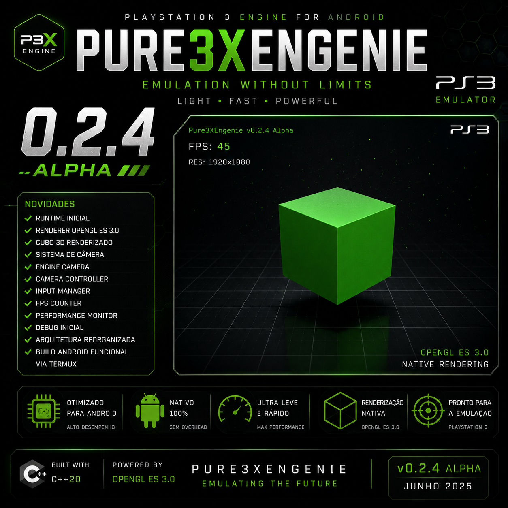

  

<h1 align="center">Pure3XEngenie</h1>

<b>Experimental PlayStation 3 Emulator Engine for Android</b>

Powered by <b>C++20</b> • Android NDK r29 • OpenGL ES 3.0 • ARM64

---

# 🚀 Sobre o Projeto

O **Pure3XEngenie** é uma engine experimental de emulação de PlayStation 3 para Android desenvolvida do zero em **C++20**. O projeto busca oferecer uma base moderna, modular e otimizada para dispositivos ARM64, utilizando recursos nativos do Android através do **Android NDK** e renderização com **OpenGL ES 3.0**.

A versão **v0.2.4 Alpha** consolida a infraestrutura do projeto e prepara o caminho para a futura interface Android nativa (Android UI), mantendo foco em desempenho e organização do código.

## 🔹 v0.2.4 Alpha

### 🎯 Objetivos Concluídos

- ✅ Renderização nativa utilizando OpenGL ES 3.0.
- ✅ Contexto gráfico Android (EGL + ANativeWindow) totalmente funcional.
- ✅ Cubo 3D renderizado diretamente pela Engine.
- ✅ Estrutura inicial da Android Runtime consolidada.
- ✅ Expansão da arquitetura Java para suporte à futura Android UI.
- ✅ Integração aprimorada entre C++20, Android NDK r29 e Java.
- ✅ Organização modular da Engine para futuras funcionalidades.
- ✅ Estrutura preparada para AndroidBridge e sistema de logs nativos.
- ✅ Preparação da base para Menu Principal, Configurações e Informações do Sistema.
- ✅ Base pronta para implementação da Android UI na próxima versão.
- ✅ Documentação atualizada.
- ✅ Imagens oficiais da versão adicionadas ao projeto.
- ✅ Backup oficial da versão v0.2.4 Alpha gerado.

### 🚀 Próximos Passos (v0.2.5 Alpha)

- 🎨 Desenvolvimento da Android UI nativa.
- 📂 Gerenciador de jogos (Game Loader).
- ⚙️ Menu de Configurações.
- 📊 Painel de Informações do Sistema.
- 📈 Contador de FPS na interface.
- 🎮 Estrutura inicial da interface inspirada na XMB.

# 🗺️ Roadmap de Desenvolvimento

O Pure3XEngenie continuará evoluindo em etapas, priorizando estabilidade, desempenho e recursos nativos para Android.

---

## 🔹 v0.2.5 Alpha — Android UI

### Objetivos
- 🎨 Interface Android nativa.
- 🏠 Menu principal da Engine.
- ⚙️ Tela de Configurações.
- 📊 Informações do Sistema.
- 📈 Contador de FPS.
- 📂 Estrutura inicial do Game Loader.
- 📝 Sistema de logs aprimorado.

---

## 🔹 v0.2.6 Alpha — Game Manager

### Objetivos
- 🎮 Gerenciador de jogos.
- 📂 Navegação por pastas.
- 💿 Detecção automática de jogos.
- 🖼️ Capas dos jogos.
- ⭐ Lista de jogos recentes.
- 🔍 Melhor organização da biblioteca.

---

## 🔹 v0.2.7 Alpha — Core Evolution

### Objetivos
- ⚡ Melhorias no Core da Engine.
- 🧠 Evolução do sistema PPU.
- 🎨 Melhorias no Renderizador RSX.
- 🔊 Base do sistema de áudio.
- 🎮 Base do sistema de entrada (Input).

---

## 🔹 v0.2.8 Alpha — Android Experience

### Objetivos
- 📱 Melhor integração com Android.
- 📂 Gerenciamento de armazenamento.
- ⚙️ Novas opções gráficas.
- 📈 Monitor de desempenho.
- 🔧 Otimizações gerais.

---

## 🔹 v0.2.9 Alpha — Performance Update

### Objetivos
- 🚀 Grande otimização da Engine.
- 🧹 Limpeza e organização do código.
- 🛠️ Correções de bugs.
- 📚 Atualização completa da documentação.
- ✅ Preparação para a fase Beta.

---

# 🚀 Série Beta

## 🔷 v0.3.0 Beta

### Objetivos
- 🎉 Primeira versão Beta oficial.
- 🎮 Android UI completa.
- 📂 Game Manager funcional.
- ⚙️ Sistema de Configurações completo.
- 📊 Monitor de desempenho.
- 🚀 Melhor estabilidade.
- 📦 Primeiro APK público para testes.

---

## 🔷 v0.3.1 Beta

### Objetivos
- ⚡ Melhorias de desempenho.
- 🛠️ Correções de bugs reportados.
- 🎨 Refinamento da interface.
- 🎮 Compatibilidade com mais jogos.
- 📚 Documentação expandida.
- 🌐 Preparação para comunidade.

---

# 🌐 Em breve

O ecossistema do Pure3XEngenie continuará crescendo.

### Em desenvolvimento

- 🌍 Site Oficial do Pure3XEngenie.
- 💬 Servidor Oficial no Discord.
- 📖 Documentação online.
- 📦 Releases oficiais.
- 📰 Notícias e Devlogs.
- 🤝 Área para contribuidores.
- 🎮 Futuras versões Beta e Stable.

> O projeto continua em desenvolvimento ativo. Novidades serão adicionadas conforme a evolução da Engine.

# 🔗 Links do Projeto

- 🌐 Site Oficial: **Em breve**
- 💬 Discord Oficial: **Em breve**
- 🐦 X (Twitter): https://x.com/Pure3X_PS3
- 💻 GitHub: https://github.com/lhuisaazevedo-boop/Pure3XEngenie

---

# 📢 Aviso

O **Pure3XEngenie** é um projeto experimental de pesquisa e desenvolvimento.

Atualmente encontra-se em fase **Alpha**, portanto diversas funcionalidades ainda estão em desenvolvimento e podem sofrer alterações sem aviso prévio.

O projeto evolui gradualmente a cada versão, priorizando desempenho, estabilidade e uma arquitetura moderna para Android utilizando **C++20**, **Android NDK r29** e **OpenGL ES 3.0**.

---

# 🤝 Contribuindo

Sugestões, correções e melhorias são sempre bem-vindas.

Caso encontre algum problema, abra uma **Issue** no GitHub ou acompanhe as novidades pelos canais oficiais do projeto.

---

# 📄 Licença

Este projeto está licenciado sob a **GNU General Public License v3.0 (GPL-3.0)**.

Consulte o arquivo **LICENSE** para mais informações.

---

Desenvolvido com ❤️ por <b>Pure3XDev</b>

© 2026 Pure3XEngenie Project. Todos os direitos reservados.

