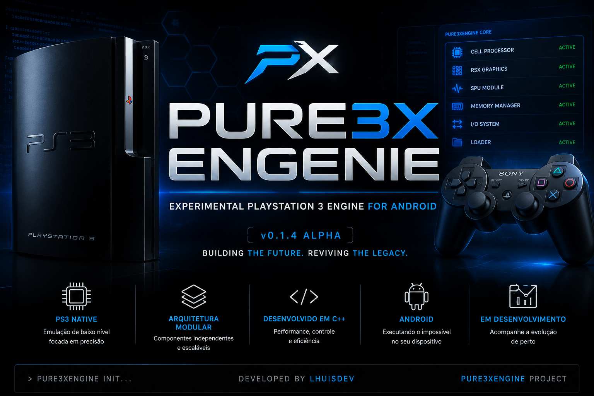

<p align="center">
  
</p>

<h1 align="center">Pure3XEngenie</h1>

<p align="center">
Engine Experimental de Emulação de PlayStation 3 para Android
</p>

---

# 🚀 Pure3XEngenie v0.1.6 Alpha

> ⚠️ **O Pure3XEngenie encontra-se em desenvolvimento na fase Alpha.**

A versão **v0.1.6 Alpha** representa um grande avanço na arquitetura interna da Engine, iniciando oficialmente a infraestrutura necessária para a futura emulação do PlayStation 3 em dispositivos Android.

**Ainda não existe execução de jogos, firmware ou Homebrew.**

O foco desta versão é preparar toda a base da Engine para futuras implementações.

---

# 📌 Status Atual

O Pure3XEngenie é uma Engine de emulação de PlayStation 3 totalmente desenvolvida do zero em C++20, voltada exclusivamente para Android.

## Objetivos atuais

- Arquitetura Modular
- Base da Engine
- Emulator Core
- Kernel Base
- Loader PS3
- Virtual File System
- Sistema JIT
- Native Code Execution
- Android NDK
- ARM64
- Preparação para Vulkan

## Status

🚧 Alpha v0.1.6

---

# ✅ Funcionalidades Implementadas

## 🟢 Boot System

- Novo Boot inspirado no PlayStation 3
- Inicialização organizada
- Carregamento dos componentes
- Status READY
- Sequência completa de Boot

---

## 📄 Logger

- Logger totalmente reestruturado
- Informações completas da Engine
- Logs em arquivo
- Boot Log
- Status dos módulos

Mostra automaticamente:

- Engine
- Platform
- Version
- Build
- Developer
- Threads
- JIT
- BlockCache
- MemoryMap
- NCE
- Scheduler

---

## 🧠 Engine Core

- Arquitetura Modular
- Organização da Engine
- Controle principal
- Preparação para expansão

---

## 📦 Version System

- Nome
- Versão
- Build
- Plataforma
- Desenvolvedor
- Linguagem

---

## ⚙️ Config Manager

- Configuração da Engine
- Configuração Modular

---

## 🌐 Network

- Informações da Rede
- Estrutura inicial

---

## 🎮 Game Modules

- Sistema modular
- Organização dos jogos

---

## 📦 Module Manager

- Registro
- Inicialização
- Encerramento

---

## 🕹 Emulator Core

- Emulator
- CPU
- GPU
- SPU
- Memory

---

## ⚙️ CPU Core

Novo sistema responsável por controlar:

- Interpreter
- Dynamic Recompiler (JIT)
- Execução híbrida

---

## ⚡ JIT Compiler

Primeira implementação da infraestrutura do Recompilador Dinâmico.

Implementado:

- Initialize()
- CompileBlock()
- Shutdown()

Preparado para:

- Tradução PowerPC → ARM64

---

## 📦 Block Cache

Primeira estrutura de cache.

Implementado:

- Inserção
- Pesquisa
- Organização dos blocos traduzidos

---

## 🧠 Memory Map

Implementação inicial do Memory Map.

Preparado para:

- Memória Virtual do PS3
- Endereços PPE
- Tradução ARM64

---

## ⚡ Native Code Execution (NCE)

Primeira infraestrutura de execução nativa.

Implementado:

- Initialize()
- LoadCode()
- Execute()
- Shutdown()

Preparado para:

- Execução ARM64
- Integração com JIT
- BlockCache
- MemoryMap

---

## 📋 Scheduler

Primeira versão do Scheduler.

Inclui:

- FIFO Queue
- Escalonador
- Organização das Threads

---

## 💿 Loader

- ELF
- SELF
- SPRX

---

## 💽 Disc / Game Manager

- Disc Manager
- Game Manager

---

## 📁 Virtual File System (VFS)

- VFS
- FileSystem
- Directory

---

## ⚙️ Kernel

- Kernel
- Process
- Thread

---

## 🧠 Memory Manager

- Gerenciamento de Memória
- Inicialização
- Leitura
- Escrita

---

# 📁 Estrutura do Projeto

```text
Pure3XEngenie/
├── assets/
│   └── images/
├── Config/
├── Docs/
├── build/
├── core/
│   ├── boot/
│   ├── config/
│   ├── disc/
│   ├── emulator/
│   ├── gamemodules/
│   ├── jit/
│   ├── kernel/
│   ├── loader/
│   ├── logger/
│   ├── memory/
│   ├── modules/
│   ├── network/
│   ├── scheduler/
│   ├── system/
│   ├── version/
│   └── vfs/
├── include/
├── src/
├── CMakeLists.txt
├── README.md
└── LICENSE
```

## 📚 Documentação

Toda a documentação oficial encontra-se na pasta:

```text
Docs/
```

Arquivos disponíveis:

- OfficialDocumentation.md
- DevelopmentRoadmap.md
- DevelopmentNotes.md
- Architecture.md
- CPU_Architecture.md
- Cell_Execution_Model.md
- CoreEngine.md
- ConfigManager.md
- BuildGuide.md
- BootSystem.md
- Graphics.md
- Installation.md
- LanguageManager.md
- LogSystem.md
- NCE.md
- NetworkManager.md
- PS3Research.md
- FAQ.md

---

## 🗺️ Roadmap

### ✅ v0.1.6 Alpha

- Novo Boot System
- Logger reestruturado
- CPU Core
- JIT Compiler
- Block Cache
- Memory Map
- Native Code Execution (NCE)
- Scheduler
- Melhor organização do projeto
- Atualização do CMake
- Estrutura preparada para Android NDK

---

### 🚧 v0.1.7 Alpha

- Decoder inicial do PPE
- Expansão do JIT
- Tradução PowerPC → ARM64
- Melhorias no Scheduler
- Integração CPU ↔ JIT
- Melhorias no MemoryMap

---

### 🚧 v0.1.8 Alpha

- Interpreter PPE
- Interpreter SPU
- Framework de Syscalls
- Melhorias no Loader
- Memory Manager avançado
- Cache de Arquivos

---

### 🚧 v0.1.9 Alpha

- Primeira execução de código PowerPC
- Testes ARM64
- Cache otimizado
- Preparação para Vulkan
- Melhorias de estabilidade

---

### 🚀 v0.2.0 Alpha

- Backend Vulkan inicial
- Framework RSX
- Shader Manager
- Texture Cache
- Framebuffer Manager
- Pipeline de Renderização
- Base para Homebrew PS3
- Primeiros testes gráficos

---

## 🔮 Futuro

Planejamento de longo prazo:

- Recompilador Dinâmico (JIT) completo
- Emulação do Cell Broadband Engine
- PPE
- SPUs
- RSX
- Vulkan otimizado
- Audio Engine
- Input Manager
- Save States
- Firmware PS3
- Homebrew
- Compatibilidade crescente com jogos comerciais

---

## 👨‍💻 Desenvolvedor

**Lhuis (LhuisDev)**

Projeto independente desenvolvido para pesquisa, aprendizado e evolução da emulação de PlayStation 3 para Android.

---

## 📜 Licença

Distribuído sob a licença **MIT**.

Você pode estudar, modificar e contribuir com o projeto, respeitando os termos da licença e mantendo os créditos do autor original.

---

## 📢 Aviso

O Pure3XEngenie encontra-se em desenvolvimento contínuo na fase **Alpha**.

Atualmente o projeto **não executa jogos, Homebrew ou firmware do PlayStation 3**.

O foco das versões atuais é construir toda a infraestrutura da Engine antes da implementação da emulação completa.

A partir da **v0.1.6 Alpha**, o projeto passou a receber atualizações frequentes, trazendo novos módulos, melhorias na arquitetura e preparação para Android ARM64.

Obrigado por acompanhar o desenvolvimento do **Pure3XEngenie**! 🚀
