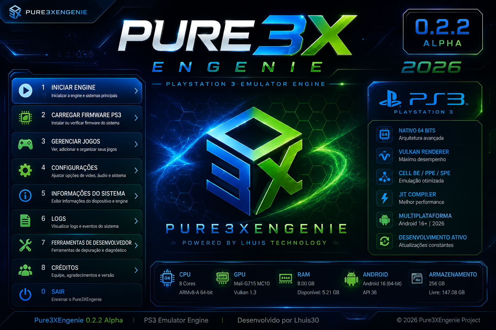

  

<h1 align="center">Pure3XEngenie</h1>

Engine Experimental de Emulação de PlayStation 3 para Android

Projeto desenvolvido em <b>C++20</b> com foco em <b>Android ARM64 (64 Bits)</b>, arquitetura modular, Vulkan e Android NDK.

  
  
  
  
  

---

## 🚀 Pure3XEngenie v0.2.2 Alpha

A versão **v0.2.2 Alpha** representa um importante avanço no desenvolvimento do Pure3XEngenie.

Nesta atualização, a infraestrutura Android foi consolidada, permitindo gerar o primeiro APK experimental do projeto. A organização do código também evoluiu, preparando uma base mais sólida para as próximas etapas da engine.

---

## ✨ Principais Novidades

- Primeiro APK experimental gerado com sucesso.
- Android Runtime estabilizado.
- Android Core atualizado.
- Android Bridge.
- JNI Bridge.
- Vulkan Framework.
- Window Manager.
- Display Manager.
- Audio Manager.
- Input Manager.
- Graphics Manager.
- Shader Manager.
- Swapchain Manager.
- Thread Manager.
- Service Manager.
- Network Manager.
- Debug Manager.
- Log Manager.
- FileSystem.
- Melhorias no Cell Engine.
- Compilação completa utilizando CMake.
- Biblioteca nativa `liblhuis.pure3x.so` gerada com sucesso.
- Correções do AndroidManifest.
- Correções do Launcher (ícone do aplicativo).
- Organização da pasta `assets/images/alpha/0.2.2`.

---

## 📱 Android Framework

- Android NDK r29 integrado.
- Inicialização do Android Runtime.
- Estrutura preparada para futuras versões do APK.
- Melhor organização dos módulos Android.
- Base preparada para Vulkan.
- Preparação para evolução da interface gráfica.

---

## 🔧 Melhorias Gerais

- Organização do projeto.
- Melhorias na estrutura dos diretórios.
- Atualização do sistema de build.
- Ajustes na documentação.
- Nova arte oficial da versão **v0.2.2 Alpha**.
- Correções gerais de estabilidade.

---

## 🗺️ Roadmap de Desenvolvimento

O Pure3XEngenie continua evoluindo em etapas. Cada versão adiciona novos componentes à infraestrutura da engine e prepara o projeto para futuras funcionalidades.

---

## 🔹 v0.2.3 Alpha

### Objetivos

- Correção do crash na inicialização do aplicativo.
- Primeira tela funcional do Pure3XEngenie.
- Melhorias na MainActivity.
- Sistema de Logs atualizado.
- Melhor organização do Android Runtime.
- Ajustes na interface inicial.
- Otimização do carregamento da biblioteca nativa.

---

## 🔹 v0.2.4 Alpha

### Objetivos

- Menu principal da Engine.
- Sistema de Configurações.
- Informações do Sistema.
- Estrutura inicial do Game Loader.
- Melhorias no gerenciamento de memória.
- Organização dos módulos internos.

---

## 🔹 v0.2.5 Alpha

### Objetivos

- Firmware Manager.
- Gerenciador de arquivos.
- Estrutura inicial do Boot System.
- Melhorias no Android Bridge.
- Atualização do sistema de módulos.
- Otimizações do Core Android.

---

## 🔹 v0.2.6 Alpha

### Objetivos

- Evolução do Cell Engine.
- Gerenciamento de memória.
- Thread Manager aprimorado.
- Scheduler inicial.
- Melhorias no sistema de Logs.
- Otimizações gerais da Engine.

---

## 🔹 v0.2.7 Alpha

### Objetivos

- Nova Interface Gráfica.
- Splash Screen oficial.
- Dashboard inicial.
- Organização dos menus.
- Melhor experiência do usuário.
- Ajustes de desempenho.

---

## 🔹 v0.2.8 Alpha

### Objetivos

- Primeiro APK oficial de testes.
- Boot experimental da Engine.
- Continuação da integração dos módulos.
- Melhorias na estabilidade.
- Correções gerais de desempenho.
- Preparação para a fase Beta.

---
## 🟢 v0.3.0 Beta

## Primeira Beta Pública

A versão **v0.3.0 Beta** marcará uma nova etapa no desenvolvimento do Pure3XEngenie.

Nesta fase, a infraestrutura construída durante as versões Alpha estará mais consolidada, permitindo evoluir para funcionalidades mais avançadas da engine.

### Objetivos

- Interface mais completa.
- Sistema de Boot aprimorado.
- Melhor gerenciamento de memória.
- Estrutura Android mais estável.
- Continuação do desenvolvimento do Cell Engine.
- Melhor organização dos módulos internos.
- Melhorias no desempenho geral.
- Base preparada para futuras implementações da emulação.

---

## 📌 Estado do Projeto

**Status:** Alpha

O Pure3XEngenie ainda está em desenvolvimento ativo.

O foco atual é construir uma infraestrutura moderna, organizada e escalável para futuras funcionalidades relacionadas à emulação de PlayStation 3 no Android.

Cada nova versão representa um avanço na arquitetura da engine e na organização do projeto.

---

## 👨‍💻 Desenvolvedor

**Lhuis (Pure3XDev)**

Projeto desenvolvido do zero utilizando:

- C++20
- Android NDK r29
- CMake
- JNI
- Vulkan
- Android Runtime
- Arquitetura ARM64 (64 Bits)

O desenvolvimento segue uma arquitetura modular para facilitar manutenção, expansão e futuras implementações.

---

## 📜 Licença

Este projeto está licenciado sob a **MIT License**.

---

## 💚 Agradecimentos

Obrigado a todos que acompanham a evolução do Pure3XEngenie.

Cada versão representa horas de estudo, testes, organização do código e melhorias contínuas na estrutura da engine.

O desenvolvimento continua e novas versões chegarão em breve.

---

**🚀 Pure3XEngenie**

**O futuro da emulação de PlayStation 3 para Android está apenas começando.**

**© 2026 Pure3XDev — Todos os direitos do projeto reservados.**

