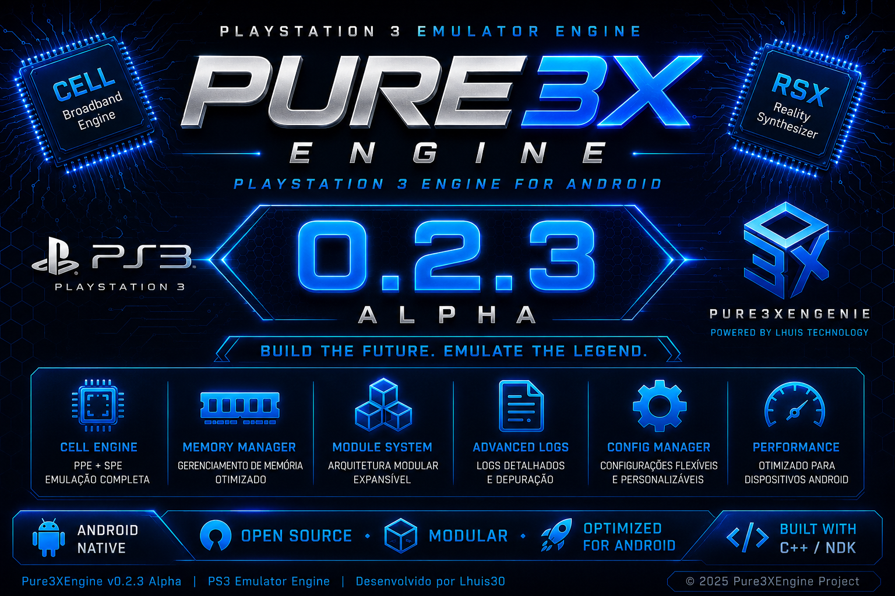

  

<h1 align="center">Pure3XEngenie</h1>

Engine Experimental de Emulação de PlayStation 3 para Android

Projeto desenvolvido em <b>C++20</b> com foco em <b>Android ARM64</b>, arquitetura modular e alto desempenho.

  
  
  
  
  

  <b>🌐 Acompanhe o desenvolvimento:</b> 
  <a href="https://x.com/Pure3X_PS3">X (Twitter) • @Pure3X_PS3</a>

---

# 🚀 Pure3XEngenie v0.2.3 Alpha

A versão **v0.2.3 Alpha** representa mais um marco importante na evolução do **Pure3XEngenie**.

Nesta atualização, a infraestrutura da Engine foi fortalecida com melhorias no **Android Runtime**, integração entre **C++20**, **JNI** e **Android NDK r29**, além de uma reorganização completa da estrutura do projeto para preparar a chegada da fase **Beta**.

## ✨ Novidades da v0.2.3 Alpha

- 🚀 Nova interface inicial (Engine Runtime).
- 📱 APK Android funcional.
- ⚙️ Melhor integração entre C++20, JNI e Android Runtime.
- 🧩 Estrutura preparada para Firmware Manager.
- 🎮 Base inicial para Game Manager.
- 🖥️ Preparação para Renderizador RSX.
- 🔊 Base dos sistemas de Áudio e Input.
- 📂 Nova organização das imagens em `assets/images/alpha` e `assets/images/logo`.
- 📚 Atualização da documentação do projeto.
- 🛠️ Melhorias na compilação utilizando Android NDK r29.
- ⚡ Melhor organização interna da Engine visando desempenho, estabilidade e evolução contínua.

---

## ⚙️ Melhorias da Engine Android

A versão **v0.2.3 Alpha** trouxe importantes melhorias para a integração da engine com o Android.

O **APK Runtime** foi aprimorado para oferecer uma base mais estável para a execução da engine, utilizando **C++20**, **JNI (Java Native Interface)** e **Android NDK r29**. Essa arquitetura permite que a maior parte do processamento seja executada em código nativo, reduzindo a sobrecarga da camada Java e preparando o projeto para uma emulação mais eficiente.

### Destaques

- 🚀 Melhor integração entre C++ e JNI.
- 📱 Base do Android Runtime otimizada.
- ⚡ Melhor gerenciamento da comunicação entre Java e código nativo.
- 🧩 Estrutura preparada para o carregamento de Firmware PS3.
- 🎮 Base pronta para o futuro Game Manager.
- 🖥️ Preparação para o Renderizador RSX.
- 🔊 Estrutura inicial para os sistemas de Áudio e Input.
- 🔋 Foco em otimização para reduzir processamento desnecessário, buscando melhor desempenho e menor consumo de energia durante a execução da engine.

> **Importante:** O Pure3XEngenie ainda está em fase **Alpha**. A emulação de jogos ainda não está disponível nesta versão. O objetivo da v0.2.3 é consolidar a base da engine para a chegada da fase **Beta**.

## 🗺️ Roadmap de Desenvolvimento

O Pure3XEngenie continua evoluindo em etapas. Cada versão adiciona novos recursos, melhorias na arquitetura e avanços na Engine para Android.

---

## 🔹 v0.2.4 Alpha

### Objetivos

- Menu principal da Engine.
- Sistema de Configurações.
- Informações do Sistema.
- Estrutura inicial do Game Loader.
- Melhorias no gerenciamento de memória.
- Organização dos módulos internos.
- Melhor integração entre Android Runtime e Engine.

---

## 🔹 v0.2.5 Alpha

### Objetivos

- Firmware Manager.
- Gerenciador de Arquivos.
- Estrutura inicial do Boot System.
- Melhorias no Android Bridge.
- Atualização do sistema de módulos.
- Otimizações do Core Android.
- Preparação do instalador de Firmware PS3.

---

## 🔹 v0.2.6 Alpha

### Objetivos

- Evolução do Cell Engine.
- Memory Manager aprimorado.
- Thread Manager.
- Scheduler.
- Melhorias no sistema de Logs.
- Otimizações gerais da Engine.
- Comunicação JNI mais eficiente.

---

## 🔹 v0.2.7 Alpha

### Objetivos

- Nova Interface Gráfica.
- Splash Screen oficial.
- Dashboard inicial.
- Organização dos menus.
- Melhor experiência do usuário.
- Melhor gerenciamento do Android Runtime.

---

## 🔹 v0.2.8 Alpha

### Objetivos

- Primeiro APK Alpha completo.
- Boot experimental da Engine.
- Integração dos módulos internos.
- Correções gerais.
- Melhor estabilidade.
- Preparação para a fase Beta.

---

# 🟢 v0.3.0 Beta

## Primeira Beta Pública

A versão **v0.3.0 Beta** marcará o início dos testes públicos do Pure3XEngenie.

### Objetivos

- Primeiro APK Beta disponível para testes.
- Sistema Android Runtime mais completo.
- Interface aprimorada.
- Melhor gerenciamento de memória.
- Continuação do desenvolvimento do Cell Engine.
- Base preparada para evolução da emulação.

---

## 🟢 v0.3.1 Beta

### Objetivos

- Melhorias de desempenho.
- Correções de bugs.
- Compatibilidade com mais dispositivos Android.
- Evolução do Game Loader.
- Melhor gerenciamento do Firmware.

---

## 🟢 v0.3.2 Beta

### Objetivos

- Biblioteca de jogos.
- Melhorias na interface.
- Ajustes do Renderizador RSX.
- Evolução do sistema de Áudio.
- Melhor gerenciamento de Input.

---

## 🟢 v0.3.3 Beta

## Evolução da Comunidade

A versão **v0.3.3 Beta** será focada na comunidade e no crescimento do projeto.

### Objetivos

- 🌐 Abertura do servidor oficial no Discord.
- 📢 Acompanhar a evolução do APK e da Engine.
- 🧪 Continuação dos testes públicos da versão Beta.
- 🐞 Sistema de envio de bugs e sugestões da comunidade.
- 📚 Melhor documentação do projeto.
- ⚡ Novas otimizações de desempenho.
- 🚀 Preparação para futuras versões Beta e para a versão estável 1.0.

---
