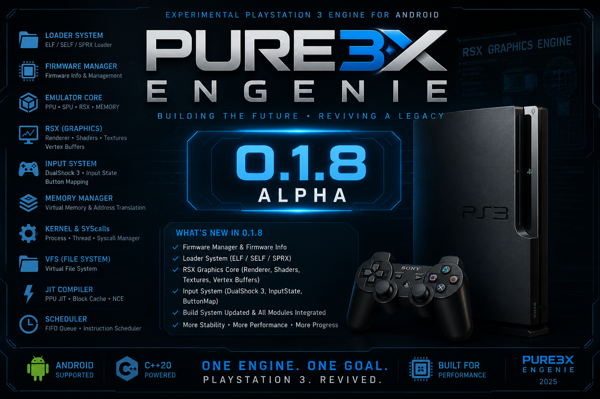

  

<h1 align="center">Pure3XEngenie</h1>

Engine Experimental de Emulação de PlayStation 3 para Android

  
  

---

# 🚀 Pure3XEngenie v0.1.8 Alpha

## 🚀 Pure3XEngenie v0.1.8 Alpha

A versão **v0.1.8 Alpha** representa mais um grande avanço na evolução do Pure3XEngenie, consolidando novos módulos da Engine e expandindo sua arquitetura interna.

O foco desta atualização foi fortalecer a infraestrutura dos sistemas de entrada (Input), iniciar a implementação do framework gráfico RSX e continuar a organização dos componentes centrais da Engine, preparando o projeto para as próximas etapas do desenvolvimento.

---

## ✨ Principais novidades

### 🎮 Input Framework

Foi implementada a primeira base do novo sistema de entrada da Engine.

Inclui:

- DualShock3
- InputState
- ButtonMap
- Estrutura para múltiplos Gamepads
- Organização do gerenciamento de dispositivos

Esta implementação servirá como base para futuros controles Bluetooth, USB e APIs nativas do Android.

---

### 🖥 RSX Framework

A Engine agora possui a estrutura inicial do processador gráfico RSX.

Novos módulos:

- Renderer
- ShaderManager
- TextureManager
- VertexBuffer

Esses componentes serão utilizados futuramente na construção do Render Backend Vulkan.

---

### 🔧 Melhorias Gerais

- Atualização completa do CMake
- Organização dos módulos da Engine
- Correções na compilação
- Melhor estrutura do código-fonte
- Documentação atualizada
- README reformulado
- Nova capa oficial da versão v0.1.8 Alpha
- Roadmap atualizado
- Melhor preparação para as próximas versões

---

A versão **v0.1.8 Alpha** reforça a base do Pure3XEngenie e estabelece uma infraestrutura ainda mais sólida para a implementação das futuras funcionalidades de emulação, renderização gráfica e compatibilidade com jogos de PlayStation 3.

##:🗺️ Roadmap

## 🚧 v0.1.9 Alpha

- Evolução do RSX Framework
- Expansão do Input Framework
- Suporte para novos Gamepads
- Melhorias no Memory Manager
- Evolução do Scheduler
- Organização do Kernel
- Aprimoramento do Loader
- Continuação da infraestrutura da Engine

---

## 🚀 v0.2.0 Alpha

- Primeiros testes nativos para Android
- Estrutura inicial JNI
- Integração com Android NDK
- Base do Render Backend
- Organização do Frontend
- Continuação da arquitetura ARM64

---

## 🚀 v0.2.1 Alpha

- Evolução do Render Backend
- Primeiros testes com Vulkan
- Pipeline RSX
- Shader Cache
- Texture Cache
- Framebuffer Manager
- Base para execução de Homebrew

---

## 🚀 v0.2.2 Alpha

- Evolução do Emulator Core
- Melhorias no RSX
- Evolução do Kernel
- Expansão das Syscalls
- Melhorias do Virtual File System (VFS)
- Otimizações da Engine
- Preparação para futuras implementações de jogos

---

## 👨‍💻 Desenvolvedor

Lhuis (LhuisDev)

Projeto desenvolvido do zero em C++20, com foco em uma arquitetura moderna, modular e otimizada para Android.

---

## 📜 Licença

Distribuído sob a licença MIT.

Você pode estudar, modificar e contribuir com o projeto, respeitando os termos da licença e mantendo os créditos do autor original.

---

## 📢 Aviso

O Pure3XEngenie é um projeto experimental voltado para pesquisa e desenvolvimento de uma Engine de emulação de PlayStation 3 para Android.

As versões Alpha concentram-se na construção da infraestrutura da Engine, incluindo CPU, SPU, RSX, Kernel, Loader, Sistema de Memória, Input, Áudio e demais componentes internos.

Cada atualização amplia a arquitetura do projeto e prepara a base para as futuras etapas de compatibilidade, renderização gráfica e execução de aplicações.

Obrigado por acompanhar o desenvolvimento do Pure3XEngenie! 🚀
