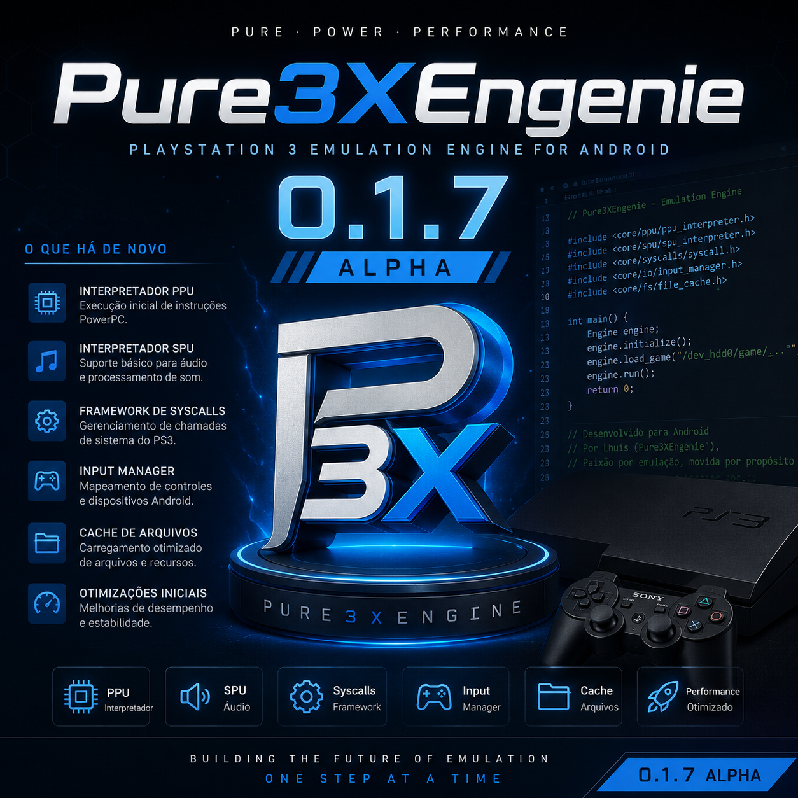

  

<h1 align="center">Pure3XEngenie</h1>

Engine Experimental de Emulação de PlayStation 3 para Android

---

## 🚀 Pure3XEngenie v0.1.7 Alpha

«⚠️ O Pure3XEngenie encontra-se em desenvolvimento na fase Alpha.»

A versão v0.1.7 Alpha representa mais um grande avanço na arquitetura do projeto, consolidando novos módulos essenciais para a futura emulação do PlayStation 3.

Ainda não existe execução de jogos, firmware ou Homebrew.

O foco desta versão é fortalecer toda a infraestrutura da Engine, preparando os principais componentes para as próximas fases do desenvolvimento.

---

## 📌 Status Atual

O Pure3XEngenie é uma Engine de emulação de PlayStation 3 desenvolvida do zero em C++20, com arquitetura modular voltada para Android.

## Objetivos atuais

- Arquitetura Modular
- Base da Engine
- Emulator Core
- Kernel Base
- Loader PS3
- Virtual File System
- Sistema JIT
- Native Code Execution
- Android NDK
- ARM64
- Preparação para Vulkan

## ✅ Funcionalidades Implementadas

## 🟢 Boot System

- Novo Boot inspirado no PlayStation 3
- Inicialização organizada
- Carregamento dos componentes
- Status READY
- Sequência completa de Boot

---

## 📄 Logger

- Logger totalmente reestruturado
- Informações completas da Engine
- Logs em arquivo
- Boot Log
- Status dos módulos

## Mostra automaticamente:

- Engine
- Platform
- Version
- Build
- Developer
- Threads
- JIT
- BlockCache
- MemoryMap
- NCE
- Scheduler

---

## 🧠 Engine Core

- Arquitetura Modular
- Organização da Engine
- Controle principal
- Preparação para expansão

---

## 📦 Version System

- Nome
- Versão
- Build
- Plataforma
- Desenvolvedor
- Linguagem

---

## ⚙️ Config Manager

- Configuração da Engine
- Configuração Modular

---

## 🌐 Network

- Informações da Rede
- Estrutura inicial

---

## 🎮 Game Modules

- Sistema modular
- Organização dos jogos

---

## 📦 Module Manager

- Registro
- Inicialização
- Encerramento

---

## 🕹 Emulator Core

- Emulator
- CPU
- GPU
- SPU
- Memory

---

#$ 🧠 PPU Interpreter

- Estrutura inicial
- Base para interpretação de instruções PowerPC
- Preparação para integração com o Kernel

---

## ⚙️ SPU Interpreter

- Estrutura inicial
- Base para processamento das SPUs
- Preparação para integração com Memory Manager e Scheduler

---

## 📞 Syscall Framework

- Syscall Manager
- Estrutura inicial das chamadas de sistema
- Base para integração com Kernel

---

## 🔊 Audio Framework

- Audio Manager
- Estrutura inicial do sistema de áudio

---

## 🎮 Input Framework

- Input Manager
- Estrutura inicial para controles e dispositivos de entrada

---

## 💾 File Cache

- Estrutura inicial de cache
- Preparação para otimização de carregamento

---

## 🖥 GPU Command Processor

- Estrutura inicial
- Base para futuros comandos da GPU RSX

---

## 🧠 Memory Bus

- Estrutura inicial
- Comunicação entre CPU, SPU, GPU e Memory Manager

---

## 🧵 Thread Manager

- Estrutura inicial
- Preparação para gerenciamento de threads do emulador

---

## ⚡ JIT Compiler

- Initialize()
- CompileBlock()
- Shutdown()

##  Preparado para:
- Tradução PowerPC → ARM64

---

## 📦 Block Cache

- Inserção
- Pesquisa
- Organização dos blocos traduzidos

---

## 🧠 Memory Map

- Estrutura inicial
- Memória Virtual
- Tradução ARM64

---

## ⚡ Native Code Execution (NCE)

- Initialize()
- LoadCode()
- Execute()
- Shutdown()

## Preparado para:

- Execução ARM64
- Integração com JIT
- BlockCache
- MemoryMap

---

## 📋 Scheduler

- FIFO Queue
- Instruction Scheduler

---

## 💿 Loader

- Loader
- ELF
- SELF
- SPRX

---

## 💽 Disc / Game Manager

- Disc Manager
- Game Manager

---

## 📁 Virtual File System (VFS)

- VFS
- FileSystem
- Directory

---

## ⚙️ Kernel

- Kernel
- Process
- Thread

---

## 🧠 Memory Manager

- Gerenciamento de Memória
- Inicialização
- Leitura
- Escrita

## 🗺️ Roadmap

## 🚧 v0.1.8 Alpha

- Evolução do PPU Interpreter
- Evolução do SPU Interpreter
- Expansão do Framework de Syscalls
- Melhorias no Memory Bus
- Melhorias no Thread Manager
- Evolução do GPU Command Processor
- Aprimoramento do Loader
- Organização do Kernel
- Otimizações da Engine

---

## 🚧 v0.1.9 Alpha

- Primeiros testes internos de execução
- Melhorias no Emulator Core
- Expansão do Scheduler
- Melhorias no Memory Manager
- Evolução do Virtual File System (VFS)
- Organização do sistema de módulos
- Preparação para integração gráfica

---

## 🚀 v0.2.0 Alpha

- Preparação para Android NDK r29
- Primeiro projeto nativo (Hello World)
- Estrutura inicial JNI
- Base para integração Android
- Organização do ambiente de desenvolvimento
- Primeiros testes nativos ARM64

---

## 🚀 v0.2.1 Alpha

- Estrutura inicial do Render Backend
- Primeiros testes com Vulkan
- Framework RSX
- Shader Manager
- Texture Cache
- Framebuffer Manager
- Pipeline de Renderização
- Preparação para execução de aplicações Homebrew

---

## 🔮 Futuro

Planejamento de longo prazo:

- Recompilador Dinâmico (JIT) completo
- Emulação do Cell Broadband Engine
- PPE
- SPUs
- RSX
- Vulkan otimizado
- Audio Engine
- Input Manager
- Save States
- Firmware PlayStation 3
- Homebrew
- Game Library
- Interface Android
- Compatibilidade crescente com jogos comerciais

---

## 👨‍💻 Desenvolvedor

**Lhuis (LhuisDev)**

Distribuído sob a licença MIT.

Você pode estudar, modificar e contribuir com o projeto, respeitando os termos da licença e mantendo os créditos do autor original.

## 📢 Aviso

O Pure3XEngenie encontra-se em desenvolvimento contínuo na fase Alpha.

Atualmente o projeto não executa jogos, Homebrew ou firmware do PlayStation 3.

O foco das versões atuais é construir toda a infraestrutura da Engine antes da implementação da emulação completa.

Cada nova versão adiciona módulos, melhorias na arquitetura e prepara a Engine para as próximas etapas do desenvolvimento.

Obrigado por acompanhar o desenvolvimento do Pure3XEngenie! 🚀
