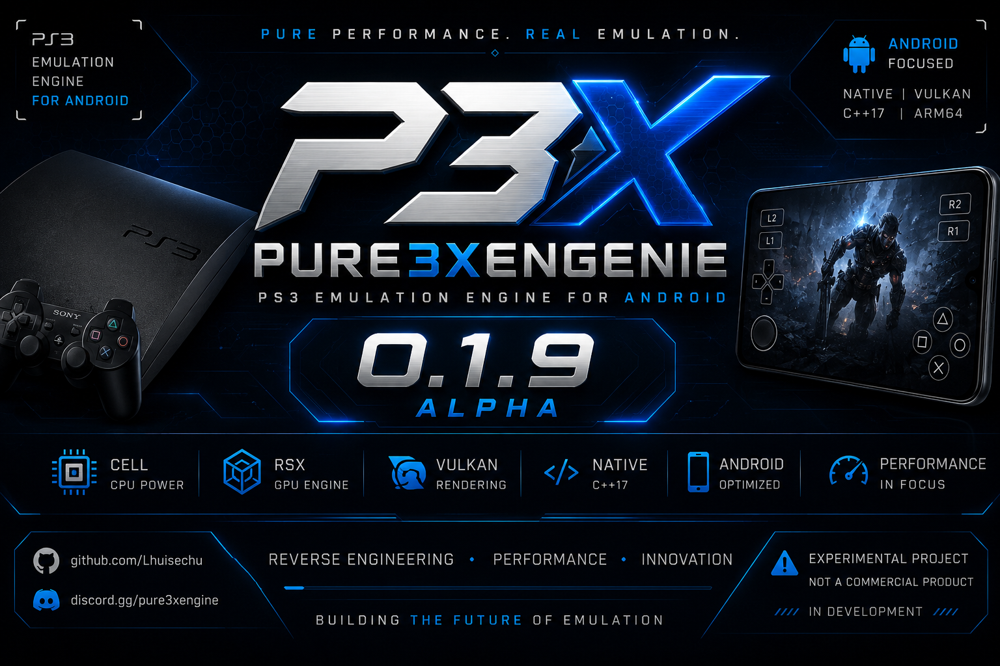

  

<h1 align="center">Pure3XEngenie</h1>

Engine Experimental de Emulação de PlayStation 3 para Android

Projeto desenvolvido em C++20 com foco em Android ARM64, Android NDK r29 e arquitetura modular.

  <a href="https://github.com/lhuisaazevedo-boop/Pure3XEngenie">
    GitHub
  </a>
  •
  <a href="https://x.com/Pure3X_PS3">
    @Pure3X_PS3
  </a>

---

## 🚀 Pure3XEngenie v0.1.9 Alpha

A versão **v0.1.9 Alpha** consolida a nova base da Engine com suporte inicial para módulos Android, JNI Bridge, APK Loader e evolução da arquitetura principal do projeto.

Esta atualização marca o encerramento do ciclo 0.1.x e inicia a preparação para a série **0.2.x**, que terá foco total em Android, Android NDK r29, integração nativa ARM64 e infraestrutura para futuras implementações do Render Backend.

---
## 📱 Android Framework

Novos módulos adicionados:

- Android NDK Bridge
- JNI Bridge
- APK Loader
- Estrutura Android inicial
- Melhor organização dos módulos Android

## 🔧 Melhorias Gerais

- Atualização completa do CMake
- Melhor organização da Engine
- Correções de compilação
- Estrutura modular expandida
- Backup oficial v0.1.9 Alpha
- Release oficial publicada no GitHub

---

## 🎯 Foco Atual

A partir da versão v0.2.0 Alpha, o desenvolvimento do Pure3XEngenie entrará em uma nova fase.

O foco principal das próximas semanas será a evolução da infraestrutura Android utilizando o Android NDK r29, preparando a Engine para futuras interfaces gráficas, integração nativa e sistemas avançados de execução.

Esta será a prioridade principal do projeto antes das próximas etapas da emulação.

---

## 🗺️ Roadmap de Desenvolvimento

### 🚀 v0.2.0 Alpha

Foco total em Android.

Objetivos principais:

- Evolução da integração Android NDK r29
- Estruturação do Android Framework
- Expansão do APK Loader
- Melhorias no JNI Bridge
- Organização dos módulos Android
- Primeiros testes de inicialização nativa
- Estrutura do Frontend Android
- Melhor gerenciamento de assets
- Melhor integração entre Engine e Android
- Continuação da arquitetura ARM64

---

### 🚀 v0.2.1 Alpha

Render Backend Inicial.

Planejamento:

- Estrutura inicial do Render Backend
- Gerenciamento de superfícies gráficas
- Sistema de apresentação de quadros
- Organização do pipeline gráfico
- Melhorias no gerenciamento de memória
- Expansão do sistema de cache
- Melhor integração com módulos RSX

---

### 🚀 v0.2.2 Alpha

RSX Framework Expansion.

Objetivos:

- Evolução do RSX Framework
- Estrutura inicial de comandos gráficos
- Organização de buffers
- Melhorias no gerenciamento de shaders
- Expansão do sistema de texturas
- Otimizações internas do pipeline

---

### 🚀 v0.2.3 Alpha

Cell Framework Expansion.

Objetivos:

- Evolução do Cell Engine
- Melhorias no gerenciamento de PPE
- Melhorias no gerenciamento de SPEs
- Expansão do Scheduler
- Organização do sistema de tarefas
- Melhor integração entre CPU e GPU

---

### 🚀 v0.2.4 Alpha

Kernel e Sistema.

Objetivos:

- Expansão do Kernel
- Novas Syscalls
- Melhorias do Virtual File System
- Melhor gerenciamento de processos
- Melhor gerenciamento de threads
- Aprimoramento da infraestrutura principal

---

### 🚀 v0.2.5 Alpha

Preparação para Emulação.

Objetivos:

- Consolidação da arquitetura da Engine
- Integração dos principais módulos
- Melhorias gerais de desempenho
- Otimizações de memória
- Refinamento da estrutura Android
- Preparação para futuras fases da emulação PlayStation 3

---

## 👨‍💻 Desenvolvedor

Lhuis (LhuisDev)

Projeto desenvolvido do zero em C++20 com foco em Android ARM64, Android NDK r29 e arquitetura modular voltada para pesquisa e desenvolvimento de tecnologias de emulação.

---

## 📜 Licença

Distribuído sob a licença MIT.

---

## 📢 Aviso

O Pure3XEngenie é um projeto experimental em estágio Alpha.

O objetivo atual não é executar jogos comerciais, mas construir uma infraestrutura sólida, moderna e escalável para futuras etapas do desenvolvimento.

A série 0.2.x terá foco total na plataforma Android e na evolução dos componentes nativos utilizando Android NDK r29.

Obrigado por acompanhar o desenvolvimento do Pure3XEngenie.
