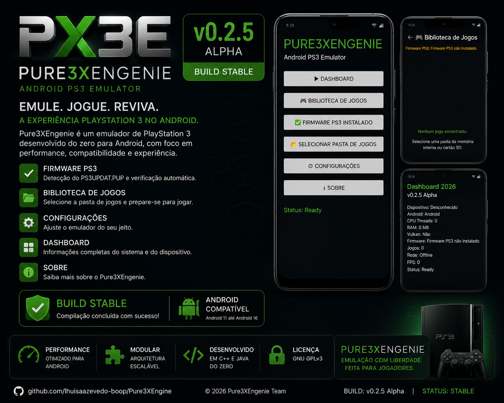

  

<h1 align="center">Pure3XEngenie</h1>

  <b>Experimental PlayStation 3 Emulator Engine for Android</b>

  Powered by <b>C++20</b> • Android NDK r29 • OpenGL ES 3.0 • ARM64

  
  
  
  
  
  

  <b>🌐 Follow the Development</b>

  

  

  
  

---

# 🚀 Sobre o Projeto

O **Pure3XEngenie** é um projeto experimental de emulação de PlayStation 3 desenvolvido para Android.

O objetivo é construir uma engine moderna utilizando **C++20**, **Android NDK r29**, **OpenGL ES 3.0** e arquitetura modular, preparada para evoluir até uma emulação nativa de alto desempenho em dispositivos ARM64.

A versão **v0.2.5 Alpha** marca um importante avanço na infraestrutura do aplicativo Android, adicionando gerenciamento inicial de firmware PS3, melhorias na interface e uma base mais sólida para as próximas versões.

---

# 🔹 v0.2.5 Alpha

## 🎯 Principais novidades

- ✅ APK Android atualizado.
- ✅ Dashboard reformulado.
- ✅ Biblioteca de Jogos aprimorada.
- ✅ FirmwareManager utilizando DocumentFile.
- ✅ Seleção de firmware através do Storage Access Framework.
- ✅ Detecção inicial do arquivo PS3UPDAT.PUP.
- ✅ Correções no MainActivity.
- ✅ Melhor organização do código Java.
- ✅ Melhorias de estabilidade.
- ✅ Build Android otimizada.
- ✅ Base preparada para futuras melhorias da XMB.

---

# 🛣️ Roadmap de Desenvolvimento

## 🔹 v0.2.6 Alpha

- Separação completa entre Firmware PS3 e Biblioteca de Jogos.
- Reconhecimento permanente do firmware.
- Primeira versão da XMB.
- Melhorias no Dashboard.
- Correções gerais do APK.

## 🔹 v0.2.7 Alpha

- Scanner automático de jogos.
- Organização da biblioteca.
- Leitura inicial dos metadados dos jogos.
- Melhor gerenciamento de armazenamento.

## 🔹 v0.2.8 Alpha

- Interface inspirada na XMB.
- Configurações gráficas.
- Informações reais de CPU, RAM, GPU e Vulkan.
- Melhorias de desempenho.

## 🔹 v0.2.9 Alpha

- Preparação do núcleo de emulação.
- Integração Java + C++.
- Melhorias na arquitetura da Engine.
- Base final antes da Beta.

## 🔹 v0.3.0 Beta

- Site oficial do Pure3XEngenie.
- Documentação completa.
- Wiki oficial.
- Changelog online.
- Identidade visual definitiva.

## 🔹 v0.3.1 Beta

- Primeira distribuição pública do APK Beta.
- Expansão dos testes em dispositivos Android.
- Coleta de feedback da comunidade.

## 🔹 v0.3.2 Beta

- Lançamento do servidor oficial no Discord.
- Organização da comunidade.
- Canal de suporte.
- Divulgação das próximas versões.

---

> **Pure3XEngenie é um projeto independente em desenvolvimento contínuo. Cada versão Alpha aproxima o projeto de uma futura Beta pública e de uma engine de emulação PS3 totalmente desenvolvida para Android.**

# 🔗 Links do Projeto

🌐 **Site Oficial:** Em breve

💬 **Discord Oficial:** Em breve

🐦 **X (Twitter):** https://x.com/Pure3X_PS3

💻 **GitHub:** https://github.com/lhuisaazevedo-boop/Pure3XEngenie

---

# 📢 Aviso

O **Pure3XEngenie** é um projeto experimental de pesquisa e desenvolvimento voltado para a emulação de PlayStation 3 no Android.

Atualmente o projeto encontra-se em fase **Alpha**. Diversas funcionalidades ainda estão em desenvolvimento e podem sofrer alterações conforme a evolução da Engine.

O desenvolvimento prioriza desempenho, estabilidade, arquitetura modular e compatibilidade com dispositivos Android modernos, utilizando **C++20**, **Android NDK r29** e **OpenGL ES 3.0**.

---

# 🤝 Contribuindo

Sugestões, correções e melhorias são sempre bem-vindas.

Caso encontre algum problema, abra uma **Issue** no GitHub ou acompanhe as novidades pelos canais oficiais do projeto.

Toda contribuição ajuda na evolução do **Pure3XEngenie**.

---

# 📄 Licença

Este projeto está licenciado sob a **MIT License**.

Consulte o arquivo **LICENSE** para mais informações.

# ⚠️ Aviso Legal

O **Pure3XEngenie** é um projeto independente, experimental e de código aberto voltado para pesquisa e desenvolvimento na área de emulação.

Este projeto **não possui qualquer vínculo, afiliação, autorização ou parceria com a Sony Interactive Entertainment, PlayStation® ou qualquer empresa do grupo Sony**.

"PlayStation" e "PS3" são marcas registradas de seus respectivos proprietários e são mencionadas apenas para fins de compatibilidade e identificação da plataforma alvo.

Os usuários são responsáveis por utilizar apenas firmware, jogos e demais conteúdos obtidos de forma legal e em conformidade com a legislação aplicável.
