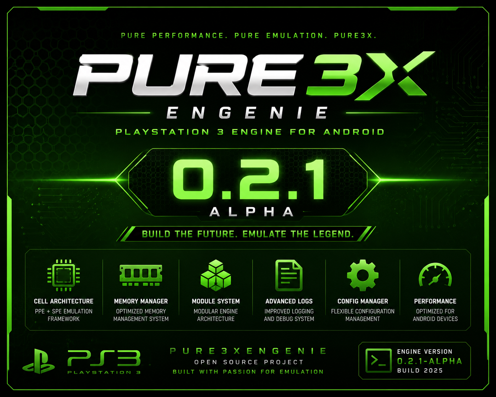

  

<h1 align="center">Pure3XEngenie</h1>

Engine Experimental de Emulação de PlayStation 3 para Android

Projeto desenvolvido em <b>C++20</b> com foco em <b>Android ARM64</b>, <b>Android NDK r29</b> e arquitetura modular.

  
  
  
  

---

## 🚀 Pure3XEngenie v0.2.1 Alpha

A versão v0.2.1 Alpha representa a consolidação da infraestrutura Android do Pure3XEngenie.

Durante esta atualização foram realizados avanços importantes na arquitetura interna da Engine, integração com Android NDK r29, organização dos módulos, geração da biblioteca compartilhada e preparação para o primeiro APK experimental.

---

## ✨ Principais Novidades

- Android Runtime
- Android Core
- Android Bridge
- JNI Bridge
- Vulkan Framework
- Window Manager
- Display Manager
- Audio Manager
- Input Manager
- Graphics Manager
- Shader Manager
- Swapchain Manager
- Thread Manager
- Service Manager
- Network Manager
- Debug Manager
- Log Manager
- FileSystem
- Melhorias no Cell Engine
- Compilação completa via CMake
- Geração da biblioteca "liblhuis.pure3x.so"

---

## 📱 Android Framework

- Android NDK r29 integrado
- Inicialização do Android Runtime
- Estrutura preparada para APK
- Melhor organização dos módulos Android
- Base preparada para Vulkan

---

## 🔧 Melhorias Gerais

- Nova organização do CoreEmulation
- Correções no sistema de Build
- Atualização do CMake
- Melhor gerenciamento interno
- Estrutura modular expandida
- Backup oficial da versão v0.2.1 Alpha
- Release oficial publicada no GitHub

---

## 🎯 Status Atual

Atualmente o projeto já consegue:

- Compilar sem erros
- Gerar executável
- Gerar biblioteca compartilhada
- Inicializar praticamente todos os módulos Android
- Preparar a infraestrutura para o primeiro APK

---

## 🗺️ Roadmap de Desenvolvimento

## 🚀 v0.2.2 Alpha

- Menu principal da Engine
- Vulkan Runtime
- Render Backend
- Window System

## 🚀 v0.2.3 Alpha

- Primeiro Cubo 3D
- Renderização Vulkan
- Pipeline gráfico inicial

## 🚀 v0.2.4 Alpha

- RSX Framework
- Buffers
- Texturas
- Shaders

## 🚀 v0.2.5 Alpha

- Cell Engine
- PPE
- SPU
- Scheduler

## 🚀 v0.2.6 Alpha

- Kernel
- Syscalls
- Virtual File System
- Process Manager

## 🚀 v0.2.7 Alpha

- Integração dos módulos
- Melhorias de desempenho
- Otimização de memória

## 🚀 v0.2.8 Alpha

- Interface inicial
- Preparação do APK
- Ajustes gerais

## 🚀 v0.2.9 Alpha

- Primeiro APK experimental
- Inicialização da interface
- Base para futuras versões Beta

---

## 👨‍💻 Desenvolvedor

Lhuis (LhuisDev)

Projeto desenvolvido do zero utilizando C++20, Android NDK r29 e arquitetura modular voltada para pesquisa e desenvolvimento de tecnologias de emulação de PlayStation 3 para Android.

---

## 📜 Licença

MIT License

---
## 
📢
O Pure3XEngenie é um projeto experimental em fase Alpha.

O objetivo atual é construir uma infraestrutura sólida, moderna e escalável para a futura emulação do PlayStation 3 no Android.

Obrigado por acompanhar o desenvolvimento do Pure3XEngenie! 🚀
